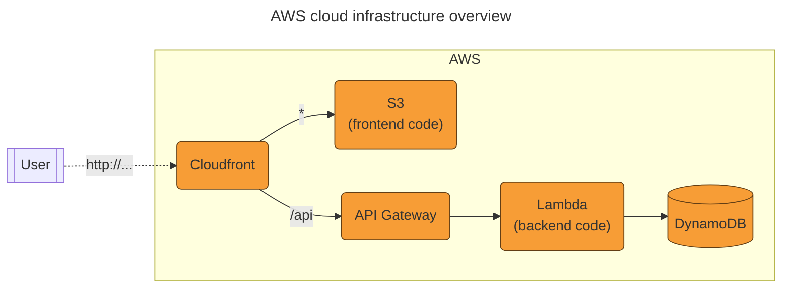

# Causalist Infrastructure

```mermaid
---
title: AWS cloud infrastructure overview
---
flowchart LR
    user[[User]]
    subgraph AWS 
    cloudfront(Cloudfront):::aws
    s3("S3<br>(frontend code)"):::aws
    api(API Gateway):::aws
    lambda("Lambda<br>(backend code)"):::aws
    dynamo[(DynamoDB)]:::aws
    end
    
    user -. "http://..." .-> cloudfront
    cloudfront -- * --> s3
    cloudfront -- /api --> api
    api --> lambda
    lambda --> dynamo
    
    classDef aws fill:#f79d36,stroke:#623e15
```
